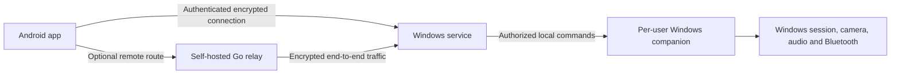

# LapCont

**Control your Windows PC from your Android phone.**


[](LICENSE)

[Get started](#install-and-pair) · [How it works](#how-the-app-works) · [Test results](#testing-status) · [Troubleshooting](#troubleshooting)

LapCont connects an Android app to a Windows service and desktop companion. It provides remote PC locking, verified Windows session events, live camera and microphone access, phone-to-PC push-to-talk, and Bluetooth proximity protection. A self-hosted relay and optional Firebase notifications extend the design beyond the local network.

Pair once, choose what your phone may access, then open your saved PC to connect. The Windows owner keeps control through individual permissions and a visible **Stop all media** button.

**Version:** 0.1.0 test build · **Documentation updated:** 8 October 2026 · **Latest recorded tests:** 6 October 2026

> **Windows unlock:** Request unlock sends a sign-in request or reminder. You still sign in normally at your PC. LapCont does not bypass Windows authentication or automatically unlock the session.

## Contents

- [Project status](#project-status)
- [Features](#features)
- [How the app works](#how-the-app-works)
- [Requirements](#requirements)
- [Install and pair](#install-and-pair)
- [Using the app](#using-the-app)
- [Technology and source layout](#technology-and-source-layout)
- [Build and test](#build-and-test)
- [Testing status](#testing-status)
- [Security and privacy](#security-and-privacy)
- [Troubleshooting](#troubleshooting)
- [Frequently asked questions](#frequently-asked-questions)
- [Remaining work](#remaining-work)
- [Contributing](#contributing)
- [License](#license)

## Project status

| Area | Current status |
|---|---|
| Implementation | The baseline app is implemented in the development workspace. |
| Verified behavior | Selected emulator and real-device checks passed; see the dated [test results](#testing-status). |
| Latest interface | Local UI checks passed. Installation on the physical phone and on-screen Windows acceptance remain pending. |
| Bluetooth auto-lock | Implemented; normal physical walk-away and return acceptance remains pending. |
| GitHub contents | Project documentation, the MIT license and repository settings. App source publication is pending. |
| Downloads | Test APK and Windows ZIP packages exist locally. GitHub release downloads are not published yet. |

Full release acceptance remains in progress. Build commands below apply to the full implementation workspace; cloning this documentation repository alone does not provide a buildable app.

## Features

| Feature | What it does |
|---|---|
| QR pairing | Uses a short-lived PC QR code, identity comparison and local approval on Windows. |
| PC permissions | The owner independently approves Lock / Request unlock, Bluetooth proximity, Camera, Microphone and Phone talk-back. |
| Remote Lock | Requests locking of the authorized Windows session; completion depends on the matching Windows event. |
| Session status and events | Displays authenticated PC status and verified Windows lock/unlock events. Disconnected status is marked stale. |
| Live camera | Shows the PC webcam on the phone using H.264, with 720p and 480p presets subject to camera support. |
| PC microphone audio | Plays permitted live PC microphone audio on the phone. |
| Push-to-talk | Hold the phone's talk button to play your voice through the PC speaker; release to stop. |
| Local Stop | A visible Windows Stop control ends camera, microphone and talk-back. |
| Nearby protection | Uses rotating Bluetooth advertisements and calibrated signal history to support automatic locking when enabled. |
| Return reminder | Can remind you to sign in when the phone returns near a locked PC. |
| Saved PCs | Keeps multiple PC pairings for manual control. One phone can advertise proximity for one PC at a time. |
| Self-hosted relay | Provides an optional outbound route for connections beyond the local network. Operator setup is required. |
| Optional push hints | Firebase can signal that events are available; the app fetches authoritative events over its authenticated connection. |
| Updated UI | Matching cards and colors, Android light/dark themes, readable text, larger controls, collapsed advanced settings and short navigation animations. |
| Back navigation | Toolbar Back and Android Back return through the correct screens. Scanner Back closes scanning first; leaving Live view stops local media. |

Features are implemented; the [testing status](#testing-status) distinguishes verified behavior from remaining acceptance checks.

## How the app works

LapCont has three main parts and an optional relay:



1. The PC owner opens a 60-second pairing QR in the Windows companion.
2. The phone scans the code and verifies the PC identity.
3. The owner compares the phone identity on the PC and selects its permissions.
4. The phone connects over the local network, or through a configured relay.
5. The Windows service checks the phone, grants and Windows user/session before forwarding a permitted action to the companion.
6. The companion performs the desktop operation and reports its state. Windows session events provide lock-state confirmation.

The Windows service coordinates access as LocalSystem. The companion runs in the owner's interactive Windows session and needs to be available for desktop operations. Closing its window keeps it in the tray; choosing Quit ends the companion.

## Requirements

| Component | Requirement |
|---|---|
| Windows PC | Windows 11 is the exercised platform. Other Windows editions require their own deployment checks. |
| Windows runtimes | x64 .NET 8 Desktop Runtime and ASP.NET Core Runtime for the current framework-dependent package. |
| Android | Android 10 / API 29 or newer; ARM64 phone recommended for physical testing. x86_64 emulator builds are also provided. |
| Initial connection | Phone and PC on a network that permits communication between them. |
| Bluetooth protection | Working PC Bluetooth observer and phone BLE advertising support, with permission and visible monitoring enabled. |
| Live view / talk-back | Available PC camera, microphone and speaker; the corresponding owner grants and phone microphone permission. |
| Remote connection | An operator-managed relay with trusted TLS and separately provisioned role credentials. |

The installed listener uses TCP **4433** by default. The standard firewall rule permits the local subnet on **Private** Windows network profiles. Shared campus/Public Wi-Fi can block pairing through firewall rules or client isolation; keep shared networks Public and use an appropriately scoped owner-approved configuration.

## Install and pair

### Available test packages

The following packages have been generated in the development workspace:

| File | Purpose |
|---|---|
| `LapCont-Windows-UI-v0.1.0.zip` | Windows service and updated desktop companion, notices and setup information. |
| `LapCont-UI.apk` | Smaller optimized Android UI test build, approximately 8.5 MiB, signed with the existing QA key. |
| `LapCont-UI-debug.apk` | Android debug build used for local UI testing. |
| `LapCont-UI-release-unsigned.apk` | Optimized Android build for signing with a release key. |
| `LapCont-UI-optionalPush-debug.apk` | Debug variant that includes the optional Firebase addon. |
| `LapCont-UI-optionalPush-release-unsigned.apk` | Optimized unsigned variant with the optional Firebase addon. |

**Package availability:** these filenames describe local test packages. Downloadable APK/ZIP releases will be linked here after publication.

### Windows

For a fresh installation:

1. Install the required x64 .NET runtimes.
2. Extract the Windows package into a folder.
3. Open an Administrator PowerShell window in the extracted folder and run:

```powershell
.\install-windows.ps1 -CompanionAtSignIn
```

4. Open `companion/LapCont.Session.exe` as your ordinary Windows user.

For the UI update when the service is already installed:

1. Extract the new UI package.
2. Choose **Quit** in the old LapCont tray menu.
3. Open **Open LapCont.cmd** in the extracted folder.

Your existing service and saved pairing can remain in place. Run one companion per Windows session. The fresh installer deliberately rejects an existing service; opening the extracted UI companion does not replace the installed files or startup entry.

### Android and pairing

1. Install the test APK. Install over the existing app to preserve its saved pairing; keep its app data.
2. Open LapCont on the PC and choose **Pair a phone**.
3. On Android, choose **Add a PC → Scan QR code**. Accessible text entry is also available.
4. Compare the displayed identities and approve the phone locally on the PC.
5. Select the permissions you want to allow.
6. Open the saved PC on the phone and choose **Connect / retry**.

Generate a fresh QR after expiry or a failed attempt. A PC identity replacement requires revoking the old pairing and pairing again.

## Using the app

### PC controls

Open a saved PC to see connection status, Windows state and controls. **Lock PC** requests a lock. **Request unlock** asks for normal Windows sign-in. **Refresh status** fetches updated authenticated state.

### Live view and audio

Approve Camera and/or Microphone on the PC, select the tracks on Android, then choose **Open Live View → Start live view**. Use **Stop live view**, Back, or the Windows **Stop all media** control to stop. Reconnecting does not automatically restart media.

To speak through the laptop, approve **Phone talk-back** on Windows, allow the phone microphone, then hold **Hold to talk · release to stop**. Release ends talk-back. PC microphone playback pauses on the phone while talking to reduce feedback. Choose an audible PC speaker if the default output is a virtual or disconnected device.

### Nearby protection

1. Approve **Bluetooth proximity** and enable the phone's participation on the PC.
2. Unpause proximity auto-lock in Windows Settings when ready to test it.
3. Enable Bluetooth monitoring on Android and allow the requested Bluetooth permissions.
4. Keep the phone beside the laptop and start calibration.
5. Verify eight valid calibration samples, a fresh numeric signal and a confirmed Near state before testing walk-away behavior.

Normal defaults are a **10-second weak-signal delay** and **30-second missing-signal grace**. Healthy observation and an armed/calibrated policy are required. All participating eligible phones must be away before locking. A failed observer or unknown signal is not treated as measured-away. Returning can send a reminder; Windows sign-in remains required.

Signal strength is an estimate, not a distance measurement. Physical walk-away/return acceptance for the latest repair remains pending. Proximity auto-lock is paused by default and was paused at the end of the recorded testing session.

### Optional internet relay and notifications

An operator can deploy the Go relay with a trusted TLS certificate, hash-only route credentials and persistent revocation storage. The PC connects outbound. Agent and phone credentials are provisioned separately through their connection settings; keep tokens out of URLs and source control.

Firebase is an optional addon enabled with `-PenableFcm=true`. It requires operator project/sender setup and opt-in. Push messages are hints: the phone checks the authenticated PC channel before presenting authoritative events. Real WAN deployment and Firebase delivery still need acceptance testing.

## Technology and source layout

| Area | Technologies |
|---|---|
| Android UI | Kotlin, Jetpack Compose, Material 3, Activity and lifecycle components. |
| Android state | Hilt, ViewModels, coroutines, StateFlow and Room metadata storage. |
| Windows | C#, .NET 8, WPF companion, Windows service, authenticated named pipes and WTS session events. |
| Camera/audio | Media Foundation H.264, WASAPI, Opus, Android MediaCodec, AudioTrack and AudioRecord. |
| Connection security | Standard TLS 1.2/1.3 with enrolled identity pinning and mutual authentication. |
| Phone identity | Android Keystore keys and encrypted per-PC secrets. |
| Windows storage | DPAPI-protected identity/enrollment data with restricted filesystem access. |
| Relay | Go and WebSocket routing with independent hashed role credentials. |
| Optional notifications | Firebase addon and operator-side HTTP v1 sender adapter. |

The implementation workspace is organized as follows. Source publication to this GitHub repository is separate from this documentation update.

```text
android/
  mobile/                 Product Android app
  transport/              Connection and protocol support
  push/                   Optional Firebase addon
  app/                    Retained Phase 0 feasibility probe
windows/
  LapCont.Service/        Windows coordinator service
  LapCont.Session/        WPF companion and desktop operations
  Agent.Core/             Permission, state and proximity policy
  Agent.Security/         Identity and protected storage
  Agent.Protocol/         Wire protocol and framing
  Agent.Platform/         Windows/native integration
  Agent.Tests/            Windows regression tests
  Session.UiChecks/       Off-screen UI navigation/layout checks
relay/                    Optional self-hosted relay
scripts/                  Build, native preparation, installation and diagnostics
docs/                     Setup, architecture, protocol and test reports
licenses/                 Third-party license notices
artifacts/                Generated packages; excluded from source control
```

## Build and test

These instructions apply to the full implementation workspace. The current pins are .NET SDK **8.0.425**, Android SDK platform **37**, build tools **36.0.0**, Gradle **9.6.0**, and Android Studio's Java runtime with JVM target **17**. The Go module pins toolchain **1.27.1**.

### Windows

From the implementation root:

```powershell
dotnet restore LapCont.sln --locked-mode
dotnet build LapCont.sln -c Release
dotnet test windows/Agent.Tests/Agent.Tests.csproj -c Release
.\scripts\package-release.ps1
```

For an off-screen component preview:

```powershell
dotnet run --project windows/Session.UiChecks/Session.UiChecks.csproj -c Release -- C:\LapCont-UI-preview
```

Explicit development mode is available through `scripts/start-development.ps1`. It runs as the current user and does not establish installed LocalSystem/SCM acceptance.

### Android

Prepare the pinned native libraries and notices, then build:

```powershell
$env:JAVA_HOME = "$env:ProgramFiles\Android\Android Studio\jbr"
$env:ANDROID_HOME = "$env:LOCALAPPDATA\Android\Sdk"
.\scripts\prepare-native.ps1
Set-Location android
.\gradlew.bat :transport:test :mobile:testDebugUnitTest :mobile:assembleDebug :mobile:assembleDebugAndroidTest :mobile:assembleRelease :mobile:lintDebug
```

The product module is `mobile`; `app` is the historical feasibility probe. Release builds are optimized and unsigned unless a signing step is supplied. QA-signed builds use the Android debug identity; production distribution requires the owner's release key.

For the optional push variant:

```powershell
.\gradlew.bat :mobile:assembleDebug :mobile:assembleRelease -PenableFcm=true
```

### Relay

From `relay`:

```powershell
go test -race ./...
go build -trimpath -ldflags '-s -w'
```

The race detector needs CGO and a supported C compiler. The relay uses operator-provisioned credentials and TLS configuration. Deployment credentials belong outside the source tree.

## Testing status

The results below were recorded on **6 October 2026**. This documentation update adds no new app test results.

### Latest UI update

| Check | Recorded result |
|---|---|
| Windows build | Passed with zero compiler warnings/errors. |
| Windows regression suite | 35 passed. |
| Windows UI component checks | 14 navigation/layout checks passed; six off-screen previews rendered. |
| Android unit suite | 8 passed, including navigation and Bluetooth selection regressions. |
| Transport unit suite | 6 unchanged passing results reused by Gradle. |
| Android UI navigation | 6 tests passed per profile: API 29 with 130% text, API 37 light, and API 37 dark with 130% text; 18 profile executions. |
| Optimized APK smoke | Exact package launch, pairing-screen navigation and repeated quick Back checks passed on API 29 / 4 KiB and API 37 / 16 KiB emulators. |
| Android lint | Zero errors; 18 warnings recorded. |
| Optional push builds | Debug and optimized unsigned builds succeeded. |
| Package checks | Signatures, native/ZIP 16 KiB alignment and notices verified; runtime private keys and test identities excluded. |

The latest emulator navigation tests used disposable PC metadata and did not start real camera/audio capture. One physical microphone test was skipped per emulator profile. Windows desktop interaction stopped when the lock screen appeared, so on-screen Windows testing remains pending despite passing component checks.

### Earlier physical testing

Earlier builds passed selected checks on a Windows 11 PC and an ARM64 Android phone: local pairing, campus-LAN connection/refresh, live media, installed service recovery, companion recovery and talk-back Stop behavior. A 30-second voice test passed, and the owner confirmed hearing their voice through the laptop speaker.

Those results retain their original build scope. The newest UI APK has not been installed on the physical phone. Bluetooth desk samples were collected in earlier checks, but a later ordinary wireless attempt showed no fresh signal/calibration; the subsequent Windows lock was manual. **Automatic walk-away locking is not recorded as passed.**

## Security and privacy

- Pairing requires an expiring QR, identity verification and local owner approval. Grants initially default to none.
- Every action is checked against the enrolled phone, Windows user/session and current permissions.
- Standard pinned mutual TLS protects the enrolled connection, including traffic routed through the optional relay.
- Windows IPC verifies the intended OS user/session and service identity.
- Phone private keys remain in Android Keystore. Windows identity material is protected with DPAPI and restricted access.
- Camera and audio are live only; the application does not record or export captured media files.
- Detected disconnection, local Stop, revocation, logoff and lease expiry stop media. Reconnection fetches status and keeps media idle.
- Media stops on Windows lock by default. Locked-session media requires explicit owner consent and separate hardware validation.
- Proximity never acts as a Windows authentication credential.
- Keep private keys, signing stores, relay tokens, service-account files and generated runtime state out of GitHub.

## Troubleshooting

| Symptom | Check |
|---|---|
| Pairing fails | Use a fresh QR, confirm the PC companion/service are running, compare identities, and check network reachability. |
| Saved PC disconnects | Reconnect and refresh. If its Wi-Fi address changed, update the address in Connection settings while retaining the pairing. |
| Campus Wi-Fi cannot connect | Public-profile firewall rules and campus client isolation can prevent direct communication. Use an approved scoped configuration or an operator relay. |
| Lock/live controls are disabled | Connect first, make the per-user companion available, and approve the corresponding PC permissions. |
| No microphone prompt | Review the app's microphone permission in Android settings and retry from the foreground Live view. |
| Talk-back is silent | Approve Phone talk-back, allow the phone microphone, hold the talk button and select a working PC speaker. |
| Bluetooth shows no samples | Enable advertising/participation, check observer health, unpause at the PC when testing, and recalibrate beside the laptop. |
| Monitoring stops in the background | Android permissions, battery policy, force-stop and reboot affect monitoring. Start visible monitoring explicitly. |
| Back closes the app from a child screen | Use the latest UI build; pairing, scanner, nested settings and Live view Back paths have regression coverage. |
| Installer rejects an existing service | It is a fresh-install script. Use the UI companion update procedure or a separately planned installed upgrade. |

## Frequently asked questions

**Can I unlock Windows from the phone?**

Request unlock sends a sign-in request or reminder. Complete normal Windows sign-in on the PC.

**Can I use LapCont away from the PC?**

Direct connections need a reachable PC on the network. Connections across separate networks require the optional operator-managed relay; real WAN acceptance remains pending.

**Does Bluetooth automatically lock the PC now?**

The feature is implemented and requires explicit enablement, healthy observation and calibration. Physical walk-away/return acceptance for the latest repair is still pending.

**Can one phone pair with several PCs?**

Yes. Manual controls support multiple saved PCs. Proximity advertising selects one PC at a time.

**Where are the source code and downloads?**

They remain in the development workspace. This repository currently publishes documentation and repository support files. Source code and release assets will be added separately.

## Remaining work

- Install the newest UI/advertising repair on the physical phone and complete normal live-media Back testing.
- Complete the on-screen Windows UI check after normal sign-in.
- Verify Bluetooth walk-away lock, return reminder, radio failure and OEM background behavior.
- Measure sustained stability, battery/CPU usage and actual end-to-end media latency.
- Complete multi-user/RDP, additional Windows edition, clean install/uninstall and recovery checks.
- Deploy and verify real mobile-data relay operation and optional Firebase delivery.
- Complete production signing and runtime/dependency servicing review before production distribution.
- Publish the implementation source and release assets.

## Contributing

Documentation improvements and reproducible bug reports are welcome. Read the [contribution guide](CONTRIBUTING.md), then use the [bug report or feature request forms](https://github.com/sgshiv001/LAPCONT/issues/new/choose).

Include the app build, Windows/Android version, steps to reproduce and observed behavior. Keep test results tied to the build and date that produced them.

## License

LapCont uses the [MIT License](LICENSE). Native libraries and dependencies retain their upstream licenses. The full implementation includes `THIRD_PARTY_NOTICES.md` and a `licenses/` directory; generated packages include the relevant notices.
