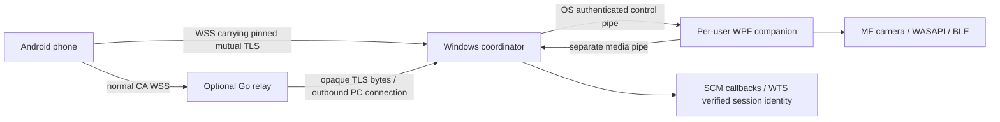

# LapCont architecture — baseline 0.1.0

The enhanced prompt is authoritative. Phases 1–7 now have implementations; acceptance status
is recorded separately in the [product report](product-test-report-2026-10-03.md). Genuine
Windows authentication remains the separate [advanced module](advanced-unlock.md).

## Processes and authority

The LocalSystem coordinator requires WTSQueryUserToken to authenticate opted-in interactive
sessions. It owns identities, phone-to-Windows-SID grants, revocation, request outcomes, events,
proximity policy and both network channels. It never executes arbitrary commands, files,
shutdown, reboot, logoff or Windows authentication. A requested session ID alone grants nothing.

The companion performs LockWorkStation, capture, playback and Bluetooth observation in its
actual Windows session. A live companion is required for desktop operations. Its visible
window/tray provides local Stop and owner consent. Media activity is not proof of an unlocked
desktop. The tray cannot appear on the Windows secure desktop. Default policy stops capture
when Windows locks; explicit local permission can allow capture while locked, subject to testing.

Production `ServiceBase` callbacks enqueue into a bounded 128-event channel. A worker queries
the affected WTS session, records its SID/user when available, and sends only scoped events.
Lock API acceptance becomes completed only after the matching authoritative Windows event;
missing confirmation times out. Startup queries WTSINFOEX or reports unknown. Request unlock
returns SIGN_IN_REQUIRED without changing verified lock state. Power transitions invalidate
proximity samples and stop capture; logoff stops it regardless of locked-media preference.

## IPC and protected storage

The service owns `LapCont.Coordinator.<session>.Control` and `.Media` named pipes, using
first-instance ownership, explicit SYSTEM/intended-user ACLs and network-SID denial. It checks
OS-reported client process session and impersonated token SID. The companion checks the server
PID against the installed LocalSystem SCM service. Only explicit development mode substitutes
same-user trust. Correlated RPC has bounded queues and an eight-second timeout; control and
media workers are independent.

Windows enrollment/identity/private material is DPAPI protected with restricted filesystem
ACLs. Protected per-Windows-SID settings prevent one user's privacy/proximity choice from
changing another user's policy. Listener topology comes from administrator-owned appsettings.
Android keeps EC private keys non-exportable in Keystore and encrypts per-PC proximity/relay
secrets with a Keystore AES-GCM key, authenticated PC-ID binding, atomic files and no backups.
Room holds non-secret PC metadata; repositories expose StateFlow to Hilt ViewModels/Compose.

## Standard end-to-end protection

C# uses Schannel SslStream; Android uses the platform SSLContext/SSLEngine over a bounded WSS
byte carrier. TLS 1.3 or TLS 1.2 ECDHE/GCM is required. Each side pins the enrolled leaf SHA-256
fingerprint and validates expiry. No global trust-all callback or custom cipher/nonce protocol
is used. Outer LAN WSS pins the PC; outer relay WSS uses normal CA/hostname trust.

Separate control/media channels use fresh full handshakes. A 32-byte single-use attachment
binds media to the current authenticated control identity/context, expiring after ten seconds.
Handshake traffic is bounded to 256 KiB/ten seconds; sessions to ten minutes/1 GiB. Android
reconnects before age expiry. C# disables resumption/renegotiation; commands never use 0-RTT.
The protocol adds exact schemas, monotonic sequence, PC-authoritative expiry, per-peer request
idempotency and live authorization checks. Reconnect fetches status only.

Pairing uses a locally opened 60-second random 32-byte QR token, atomic reservation, proof of
phone key possession and local fingerprint/grant confirmation. Grants default to none. Separate
random proximity material is delivered only after consent. Permission changes close channels
and stop leases; revocation removes enrollment, stops devices and invalidates relay routes.
Offline relay revocations are protected and retried, with persistent relay-side revocation state.

## Proximity

Android advertises FFF0 service data with a 16-byte rotating value: four-byte 30-second epoch
and 12-byte truncated HMAC over enrolled PC/phone/epoch using a separate random key. Advertised
legacy payload totals 23 bytes with flags. No permanent phone MAC, secret or Windows username
is broadcast. Only one PC is advertised by a phone at a time; unsupported multiple-PC activation
is reported. Multiple explicitly enabled phone keys participate independently at the PC.

Windows aggregates at most one RSSI bucket per second per phone and preserves monotonic sample
age through authenticated IPC. Policy retains 60 samples and requires seven recent valid buckets.
Calibration requires eight distinct buckets, derives away threshold as median minus 12 dB,
and then a confirmed near state arms it. Weak signal must persist ten monotonic seconds; absent
signal becomes away after 30 seconds only when healthy and armed. Gaps, startup, failure and
resume reset/rebuild evidence. All eligible keys must be away to lock. Stable return sends one
sign-in reminder with cooldown, never authenticates Windows. RSSI and rotating beacons do not
prevent signal relay and cannot be used as access credentials.

## Live media and lifecycle

Windows negotiates supported native camera modes, converts to NV12, prefers asynchronous
hardware MF H.264, and falls back to synchronous software before the first access unit only.
After capture has started, a fault stops it and needs a new explicit request. ICodecAPI controls
low latency, no B frames and GOP/keyframe requests; actual negotiated encoder path is reported.
Annex B complete access units, SPS/PPS and IDR start/recovery/about every two seconds are framed
with a common monotonic stream origin. Presets are 720p30/2 Mbps and 480p30/1 Mbps. Unsupported
modes fail explicitly rather than claiming a capture format.

WASAPI capture converts actual native channel/float format to mono 48 kHz and Opus 960 samples,
64 kbps. Android uses MediaCodec to the foreground Surface and libopus/AudioTrack with a bounded
initial 60 ms jitter mapping and late discontinuity reset. Native audio loading and video decoder
creation complete before requesting capture; SPS/PPS then configure the decoder. Temporary input
buffer unavailability drains output and retries for at most 500 ms. A longer stall stops the stream.
Audio focus loss, route changes, invalid Surface and overload stop playback. The PC media queues
allow 32 frames and 4 MiB each, including in-flight writes; the phone allows 64 frames and 4 MiB.
Capture workers may wait at most 250 ms for a full IPC queue, with cancellation interrupting the
wait. A deadline cancels the pending write so it cannot enqueue after the stream has ended.
Overflowing dependent video is stopped instead of silently dropped.
The Android encrypted WebSocket carrier separately allows 64 chunks and 1 MiB, covering
short decoder startup bursts without allowing an unbounded network backlog.

Talk-back uses foreground permission-gated AudioRecord, mono Opus and PC WASAPI playback.
Press release/cancel/background/connection loss stop the action. PC mic playback is muted on
Android while talking. Capture leases expire at 30 seconds and talk leases at five seconds,
independently enforced by both service and companion. Ended stream IDs cannot be renewed into
new capture. Network and local Stop use control workers separate from media. Raw media is never
written to a file or diagnostic log.

## Relay, events and notifications

The Go relay binds independent hashed credentials to agent/phone roles, route, phone and channel.
It arbitrates one pair per channel, rejects offline phones instead of queuing, enforces message,
connection and rate limits, heartbeats and bounded writes, and closes both endpoints on failure.
Only encrypted inner TLS bytes cross it. Persistent revocation fails closed; graceful shutdown
closes active routes. The container is non-root, read-only and uses a separate writable state volume.

The PC retains at most 128 event metadata records for five minutes. A control status response
returns up to three scoped events and two session summaries within the 4 KiB envelope. Live
notifications derive only from authenticated events and deduplicate IDs. Monitoring is explicitly
started in a visible non-sticky foreground service; Android can still suspend/stop it.

The default APK has no Firebase dependency. Optional Firebase data-only hints identify a PC,
then require a bounded authenticated fetch of real events before presenting authoritative status.
Operator public project setup and HTTP v1 trusted-sender credentials remain external. No private
sender credentials enter the APK; no delivery guarantee is made. Diagnostic export uses an
allowlist and excludes tokens, private identities, personal event fields and all media.
